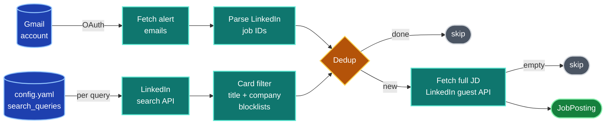
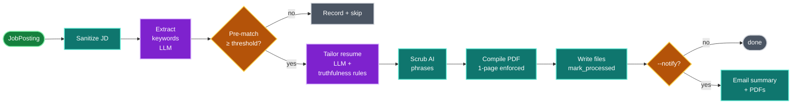
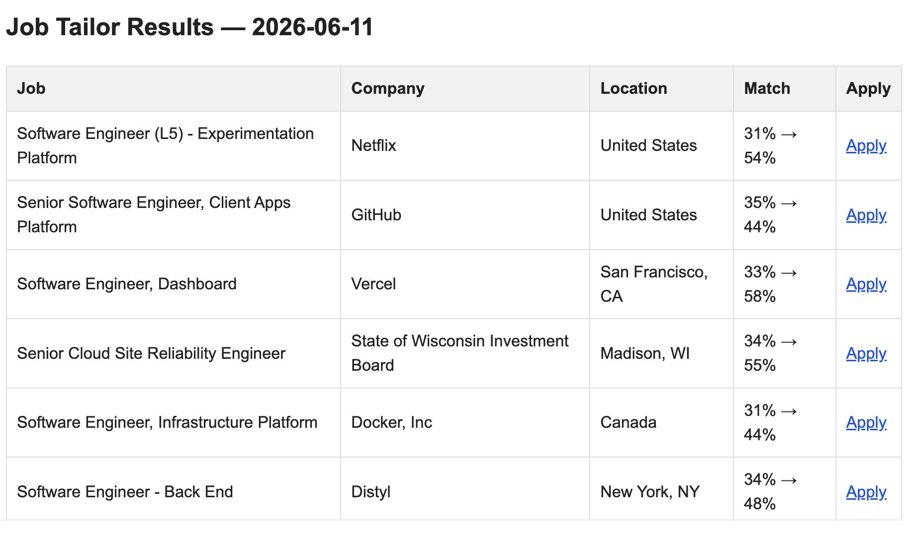

# job-copilot

   

A personal pipeline that filters incoming job alerts and tailors a LaTeX resume per role, with LLM truthfulness guardrails. Built for myself, open-sourced as a portfolio reference.

LinkedIn surfaces 20–30 alert emails a day. Manually triaging each one and tailoring a resume to the strong matches was a 15-minute job per posting; this pipeline does the triage and writes a first-draft tailored resume so the human review is editing rather than creating.

## Built on

- **[LiteLLM](https://github.com/BerriAI/litellm)** — the transport layer. `src/_internal/llm.py` wraps it with retry policies, JSON-mode capability detection, response-text normalization, and provider-specific `api_base` cleanup so the rest of the codebase only knows `complete()` / `complete_json()`.
- **Anthropic Claude (`claude-sonnet-4-20250514`)** is the default model. Any provider LiteLLM supports works — Anthropic, OpenAI, Gemini, OpenRouter, DeepSeek, and Ollama for fully-local runs.
- **pdflatex** — single-pass LaTeX compilation. The pipeline retries at 10pt if the output exceeds one page so resumes stay scannable.
- **Gmail API** (via `google-api-python-client`) — read incoming LinkedIn alert emails and send the result notification with PDF attachments.
- **[Resume Matcher](https://github.com/srbhr/Resume-Matcher)** (Apache-2.0) — prompts in `src/_internal/prompts/` are derived from upstream.

## How it works

The CLI has two ingress modes. `run --source email` reads incoming LinkedIn alert emails from Gmail and extracts the job IDs from the HTML body. `run --source search` queries the LinkedIn guest API directly using saved search definitions in `config.yaml`. Both modes converge on the same downstream pipeline; the Docker cron deployment runs both sources back-to-back every 6 hours.

### Ingestion



The card-level filter is a deliberate cost-cutting step: title and company blocklists run on each search-result card *before* any full-JD fetch or LLM call. Surviving cards are then deduped against `processed_jobs.json` so reruns never re-fetch the same posting.

### Per-job tailoring



Output for each tailored job lands in `data/output/` as three files: the tailored `.tex`, the compiled `.pdf`, and a `_changes.md` report showing pre/post match %, what changed, matched keywords, missing-but-injectable keywords, gaps that cannot be added truthfully, and any AI phrases that were scrubbed.

## What it looks like

A single cron run typically produces 4–8 tailored PDFs that arrive as one notification email with the resumes attached.

**The notification email** — match-score table with apply links, one row per tailored job. PDFs are attached so the human reviewer can skim them all without opening the repo:



**The `_changes.md` report** is where the truthfulness rules show their work. Excerpted from a real run (System Software Engineer at Hewlett Packard Enterprise, 27% → 47% match):

```markdown
**Pre-tailor match:** 27% → **Post-tailor match:** 47%

## Changes Made
• Skills section restructuring: emphasised "Distributed Systems & Cloud"
  and "APIs & Databases" categories that directly match job requirements
• Incorporated "Microservices", "ElasticSearch", "SQL", "NoSQL" into
  skills section (all already present in source resume)
• Modified first bullet to lead with "distributed systems architecture"
• Maintained all original achievements: preserved all quantitative
  metrics and specific accomplishments while incorporating job-relevant
  terminology

### Matched (14 of 30 keywords):
Docker, ElasticSearch, Kubernetes, ML concepts, NoSQL, Python, RESTFUL APIs,
SQL, distributed systems, mentoring, microservices, software engineering,
system architecture, troubleshooting

### Gaps (not in your resume — cannot add truthfully):
- Cassandra
- Golang
- Java
- Kafka
- MongoDB
- PostgreSQL
- Spark
```

The `Gaps` section is the truthfulness rules in action: the LLM identified 16 keywords the JD asked for that aren't in the source resume, and refused to invent them. Those gaps are surfaced to the human reviewer instead — useful signal for "should I actually apply" and for deciding what real skills to build next.

## Engineering highlights

- **Multi-provider LLM routing.** Wraps LiteLLM's `Router` with explicit retry policies (auth=0, rate-limit=3, timeout=2, internal-server=2) and provider-specific `api_base` normalization. Supports Anthropic, OpenAI, Gemini, OpenRouter, DeepSeek, Ollama. (`src/_internal/llm.py`)
- **JSON-mode prompting with bounded extraction.** Capability-detects `response_format` support per model via LiteLLM's registry. The JSON extractor handles markdown-fenced output, reasoning-model `<think>` tags (deepseek-r1, qwq), and unbalanced-brace truncation — with recursion depth and content-size limits. Content-quality retries warm the temperature on each attempt so a malformed-output rut breaks on the next sample.
- **Truthfulness guardrails as prompt-level invariants.** The system prompt declares six non-negotiable rules — no fabricated skills, no inflated metrics, no synonym sleight-of-hand, no implied roles — and tells the model to *accept a worse keyword match* rather than break them. Keyword injection requires the keyword to already exist in the base resume; the LLM reorders emphasis, it does not invent. (`src/_internal/prompts/templates.py`)
- **AI-phrase scrubber.** A deterministic post-processing pass against a curated blacklist of LLM tells (`leveraged`, `cutting-edge`, `seamlessly`, marketing flourishes, em-dash separators, etc.). Each entry has an explicit replacement; pure filler gets deleted, action verbs get plainer substitutes (`spearheaded` → `led`). Phrases that appear in the JD itself are protected. (`src/_internal/prompts/refinement.py`)
- **Deterministic dedup state.** Flat JSON file keyed by LinkedIn job ID, with pre/post match %, output path, and timestamp per job. Filtering happens before LLM calls so reruns cost nothing on already-processed work.
- **Card-level filtering before any fetch.** Title and company blocklists run on LinkedIn search-result cards (word-boundary matches) — strictly a cost-cutting step that prevents wasted LinkedIn JD fetches and LLM calls.
- **Single-page PDF budgeting.** Content-budget enforcement and font-size fallback during LaTeX compilation to keep output to one page regardless of how much the LLM produces.
- **Docker + cron deployment.** Compose file with bind-mounted state, host-side cron wrapper that runs both email and search sources back-to-back.
- **Operational reality.** 50 resumes tailored across 55 distinct companies between April and June 2026, running unattended on a 6-hour cron. Zero fabrication incidents — the truthfulness rules visibly hold, see the `Gaps` section in any `_changes.md` for the keywords the LLM refused to invent.

## Responsible use

This tool tailors candidate resumes; the human applies. It does not auto-submit applications.

- The LLM is constrained by `CRITICAL_TRUTHFULNESS_RULES`. It cannot invent skills, employers, dates, or accomplishments that aren't already in the source resume.
- Keyword injection requires the keyword to exist somewhere in the source — the prompt reorders emphasis to surface relevant content, it does not fabricate new content.
- Every generated PDF and its `_changes.md` report is reviewed before the human submits anything. The pipeline produces candidates, not submissions.
- LinkedIn data is fetched only from the unauthenticated `jobs-guest` endpoint — the same JSON a logged-out browser sees on `linkedin.com/jobs/view/{id}`. The `linkedin.request_delay_seconds` setting (default 3s) paces requests.
- `tailoring.enable_ai_phrase_removal` scrubs common AI-generated phrasings so the output reads as the user's own writing, not as obvious LLM output.

## Setup

See [`DEPLOY.md`](DEPLOY.md) for the full local and Docker deployment guide.

Short version:

```bash
uv venv --python 3.13
source .venv/bin/activate
uv pip install -r requirements.txt
cp .env.example .env                                # add API key
cp config/config.yaml.example config/config.yaml    # set queries, model, email
cp config/credentials.json.example config/credentials.json   # replace with real Gmail OAuth creds
cp resume/base_resume.tex.example resume/base_resume.tex     # then replace with your real LaTeX resume
python -m src.cli test-gmail
python -m src.cli run --source search --dry-run
```

## Layout

```
src/
├── cli.py              Click CLI entrypoint
├── pipeline.py         Orchestrator: JD → tailor → compile → report
├── linkedin_client.py  Guest-API client + card-level filter
├── gmail_client.py     OAuth + alert fetch + send-results
├── email_parser.py     Parse LinkedIn alert HTML into job references
├── resume_tailor.py    LLM prompt building, truthfulness rules application
├── adapters.py         Keyword extraction, AI-phrase scrub, match scoring
├── pdf_compiler.py     pdflatex wrapper
├── state.py            Dedup tracker (processed_jobs.json)
├── models.py           Dataclasses
└── _internal/          LiteLLM wrapper + tailoring prompts + AI-phrase
                        blacklist (see _internal/__init__.py)
```

## Status

Personal tool, actively used. Open-sourced as a portfolio reference — not packaged for general distribution. Issues and PRs welcome; best-effort response time since this is a side project.
