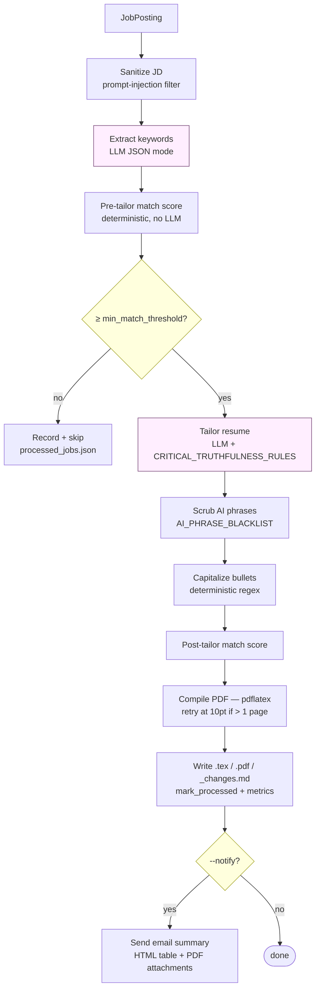

# job-copilot

A personal pipeline that filters incoming job alerts and tailors a LaTeX resume per role, with LLM truthfulness guardrails. Built for myself, open-sourced as a portfolio reference.

## How it works

The CLI has two ingress modes. `run --source email` reads incoming LinkedIn alert emails from Gmail and extracts the job IDs from the HTML body. `run --source search` queries the LinkedIn guest API directly using saved search definitions in `config.yaml`. Both modes converge on the same downstream pipeline: keyword extraction, match-score gate, LLM tailoring, AI-phrase scrub, PDF compile, dedup state update, and optional email notification. The Docker cron deployment runs both sources back-to-back every 6 hours.

### Email source (`run --source email`)

```mermaid
flowchart TD
    G[(Gmail account)] -->|OAuth, gmail.readonly| F[Fetch alert emails<br/>from:jobs-noreply@linkedin.com<br/>newer_than:Nd]
    F --> P[Parse LinkedIn job IDs<br/>from HTML alert body]
    P --> D{Dedup filter<br/>data/processed_jobs.json}
    D -->|already processed| X1([skip])
    D -->|new| L[LinkedIn guest API<br/>fetch_job&#40;id&#41;]
    L -->|empty JD| X2([skip])
    L -->|JobPosting| T[Shared tailor pipeline]

    classDef store fill:#eef,stroke:#447
    class G,D store
```



### Search source (`run --source search`)

```mermaid
flowchart TD
    C[(config.yaml<br/>linkedin.search_queries)] -->|per query| S[LinkedIn search<br/>guest API + filters<br/>f_E, f_WT, f_JT, f_TPR]
    S --> CF[Card-level filter<br/>title + company blocklists<br/>word-boundary regex]
    CF --> D{Dedup filter<br/>data/processed_jobs.json}
    D -->|already processed| X1([skip])
    D -->|new| L[LinkedIn guest API<br/>fetch_job&#40;id&#41;]
    L -->|empty JD| X2([skip])
    L -->|JobPosting| T[Shared tailor pipeline]

    classDef store fill:#eef,stroke:#447
    class C,D store
```



The card-level filter is a deliberate cost-cutting step: title and company blocklists run on each search-result card *before* any full-JD fetch or LLM call. Surviving cards are then deduped against `processed_jobs.json` so reruns never re-fetch the same posting.

### Shared tailor pipeline (per job)



Output for each tailored job lands in `data/output/` as three files: the tailored `.tex`, the compiled `.pdf`, and a `_changes.md` report showing pre/post match %, what changed, matched keywords, missing-but-injectable keywords, gaps that cannot be added truthfully, and any AI phrases that were scrubbed. Dedup state in `data/processed_jobs.json` prevents re-processing on subsequent runs.

## Engineering highlights

- **Multi-provider LLM routing.** Wraps LiteLLM's `Router` with explicit retry policies (auth=0, rate-limit=3, timeout=2, internal-server=2) and provider-specific `api_base` normalization. Supports Anthropic, OpenAI, Gemini, OpenRouter, DeepSeek, Ollama. (`src/_vendor/llm.py`)
- **JSON-mode prompting with bounded extraction.** Capability-detects `response_format` support per model via LiteLLM's registry. Custom JSON extractor handles markdown-fenced output, thinking-model tags (`<think>...</think>` from deepseek-r1/qwq), and unbalanced-brace truncation — with recursion depth and content-size limits. Retries on `JSONDecodeError` with progressively higher temperature.
- **Truthfulness guardrails baked into the prompt.** `CRITICAL_TRUTHFULNESS_RULES` (see `src/_vendor/prompts/templates.py`) forbid inventing skills, employers, dates, or accomplishments. Keyword injection requires the keyword to already exist in the base resume — the LLM reorders emphasis, it does not fabricate.
- **AI-phrase scrubber.** Post-processes LLM output against a curated blacklist of overused AI phrasings (`leverage`, `cutting-edge`, `seamlessly`, etc.) with deterministic replacements. (`src/_vendor/prompts/refinement.py`)
- **Deterministic dedup state.** Flat JSON file keyed by LinkedIn job ID, with pre/post match %, output path, and timestamp per job. Filtering happens before LLM calls so reruns cost nothing on already-processed work.
- **Card-level filtering before any fetch.** Title and company blocklists run on LinkedIn search-result cards (word-boundary matches) — strictly a cost-cutting step that prevents wasted LinkedIn JD fetches and LLM calls.
- **Single-page PDF budgeting.** Content-budget enforcement and font-size fallback during LaTeX compilation to keep output to one page regardless of how much the LLM produces.
- **Docker + cron deployment.** Compose file with bind-mounted state, host-side cron wrapper that runs both email and search sources back-to-back.

## Responsible use

This tool tailors candidate resumes; the human applies. It does not auto-submit applications.

- The LLM is constrained by `CRITICAL_TRUTHFULNESS_RULES`. It cannot invent skills, employers, dates, or accomplishments that aren't already in the source resume.
- Keyword injection requires the keyword to exist somewhere in the source — the prompt reorders emphasis to surface relevant content, it does not fabricate new content.
- Every generated PDF and its `_changes.md` report is reviewed before the human submits anything. The pipeline produces candidates, not submissions.
- LinkedIn data is fetched only from the unauthenticated `jobs-guest` endpoint — the same JSON a logged-out browser sees on `linkedin.com/jobs/view/{id}`. The `linkedin.request_delay_seconds` setting (default 3s) paces requests.
- `tailoring.enable_ai_phrase_removal` scrubs common AI-generated phrasings so the output reads as the user's own writing, not as obvious LLM output.

## Setup

See [`DEPLOY.md`](DEPLOY.md) for the full local and Docker deployment guide.

Short version:

```bash
uv venv --python 3.13
source .venv/bin/activate
uv pip install -r requirements.txt
cp .env.example .env                                # add API key
cp config/config.yaml.example config/config.yaml    # set queries, model, email
cp config/credentials.json.example config/credentials.json   # replace with real Gmail OAuth creds
# Put your LaTeX resume at resume/base_resume.tex
python -m src.cli test-gmail
python -m src.cli run --source search --dry-run
```

## Layout

```
src/
├── cli.py              Click CLI entrypoint
├── pipeline.py         Orchestrator: JD → tailor → compile → report
├── linkedin_client.py  Guest-API client + card-level filter
├── gmail_client.py     OAuth + alert fetch + send-results
├── email_parser.py     Parse LinkedIn alert HTML into job references
├── resume_tailor.py    LLM prompt building, truthfulness rules application
├── adapters.py         Keyword extraction, AI-phrase scrub, match scoring
├── pdf_compiler.py     pdflatex wrapper
├── state.py            Dedup tracker (processed_jobs.json)
├── models.py           Dataclasses
└── _vendor/            Vendored LLM + prompt modules from the original Resume
                        Matcher backend (trimmed; see _vendor/llm.py for notes)
```

## Status

Personal tool, actively used. Open-sourced as a portfolio reference — not packaged for general distribution. Issues and PRs are welcome but I may not respond quickly.

## Background

This started as `tools/job-tailor/` inside a fork of [Resume Matcher](https://github.com/srbhr/Resume-Matcher). Only the LLM wrapper, the keyword-extraction prompt, the truthfulness rules, and the AI-phrase blacklist were ever used from the upstream backend — those are vendored under `src/_vendor/`. The rest of the fork (FastAPI app, Next.js frontend, dashboard) is unrelated to this tool.
